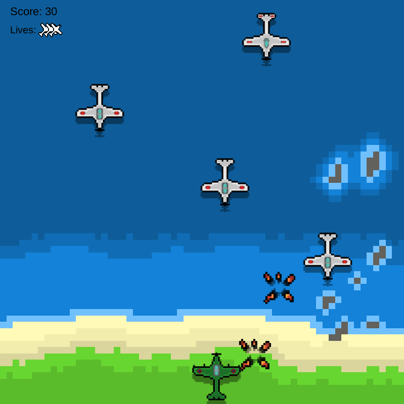
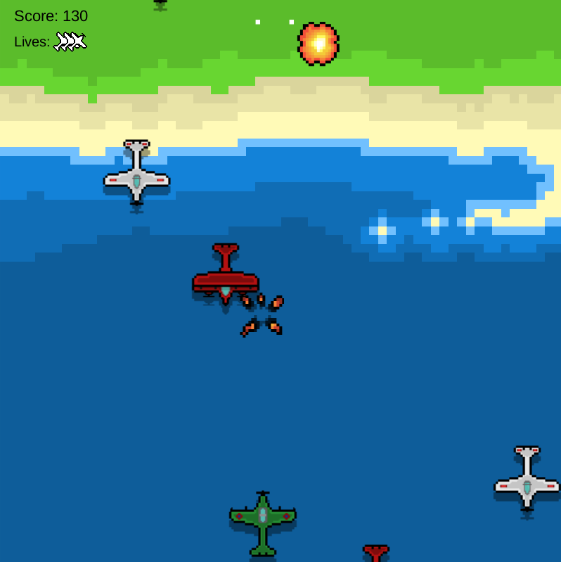
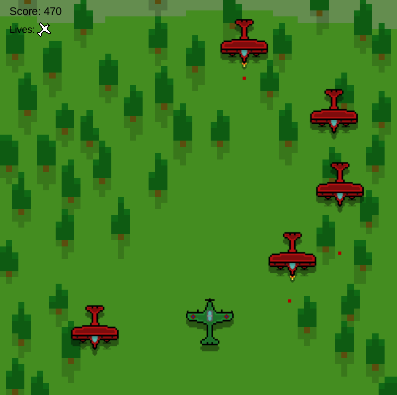
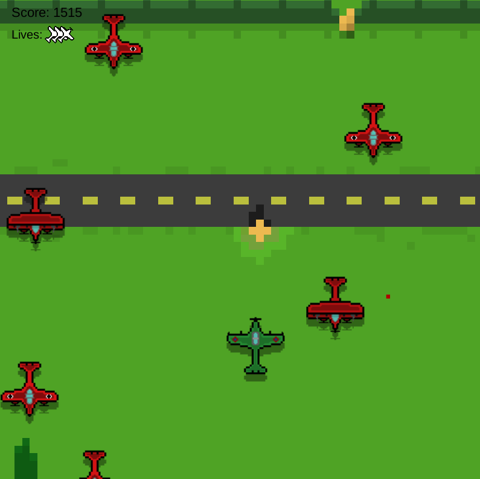
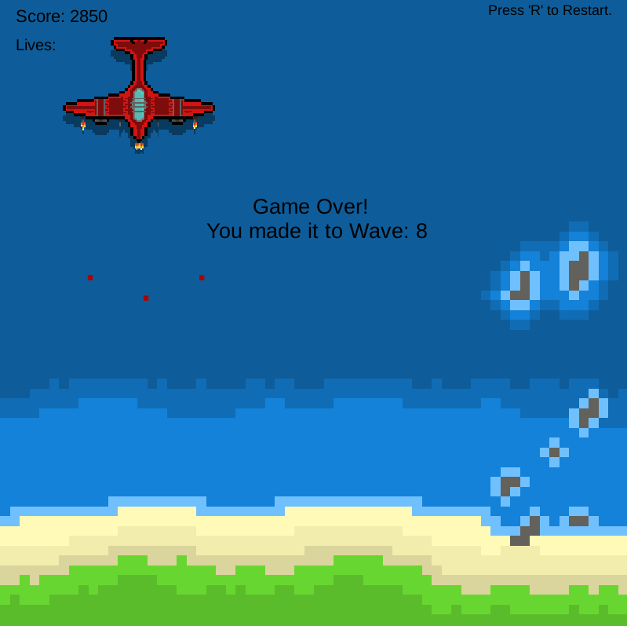

# 2017 Unity2d Project - Skystorm

Try out the WebGl version of the game here! [https://j-cob44.github.io/skystorm_unity2d/](https://j-cob44.github.io/skystorm_unity2d/)

Working in Unity version 5.6.0f3  
Will not work in newer Unity versions yet do to deprecations.  

Skystorm is an attempt at creating a game similar Flying Shark from 1987 in Unity.  
Currently features 8 waves with a boss fight on the final level.  

Features:  
- Powerups
- 8 Waves with a final boss
- Steam integration on steam build
- Endless mode after completing the game once

 

# Screenshots:

 

# Current Plans:

TODO: 
- Remove steamworks integration for standalone builds
- Upgrade to lastest Unity versions
- Add more levels and pick up where I left off back in 2017
- Add custom music
- Fix any outstanding bugs with the game

 

# Acknowledgements
Current credits for music to: Bag Raiders - Shooting Stars  

 
 
 

Thanks for checking my game out!  
-Jacob
